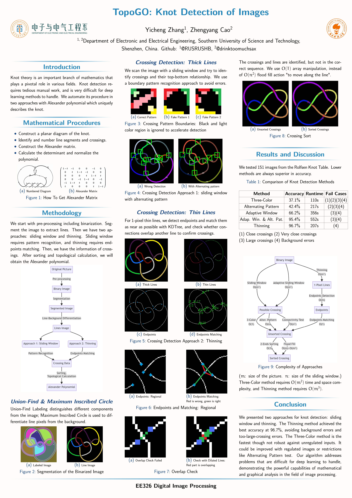

# TopoGO_SUSTech_EE326_Project

这个项目能够识别一张扭结图片获得其拓扑不变量。

This project can recognize a knot image and get its topological invariant.

`main.py`, `line_main.py`: 逐步展示如何处理一张图片(How to process one image, step by step)

`run_all.py`, `run_all_line`: 进行所有图片的处理(Process all images)

`TopoGO_Knot-Detection-of-Images.pdf`是报告

`SUSTech_DIP_Poster`是海报

`All_result_analysis.xlsx`是结果分析

输入图像来自Knot Atlas

> TODO: 证明其与其他拓扑不变量的转化关系；使用别的方法获得亚历山大多项式

